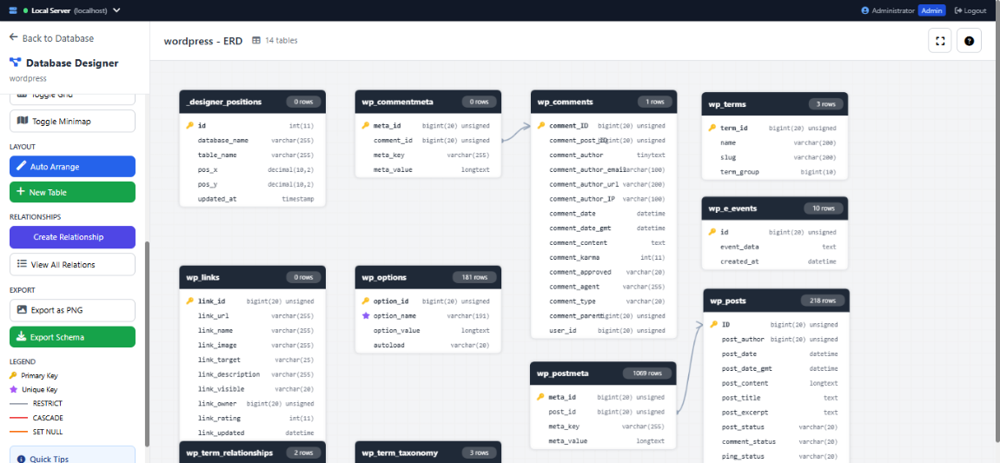
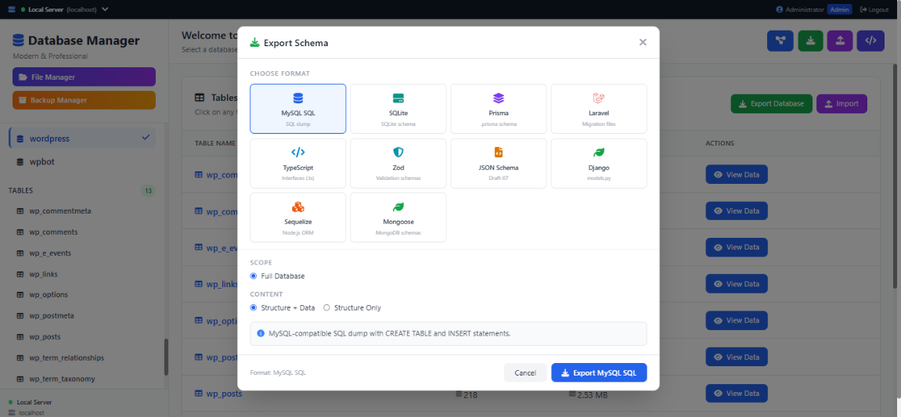
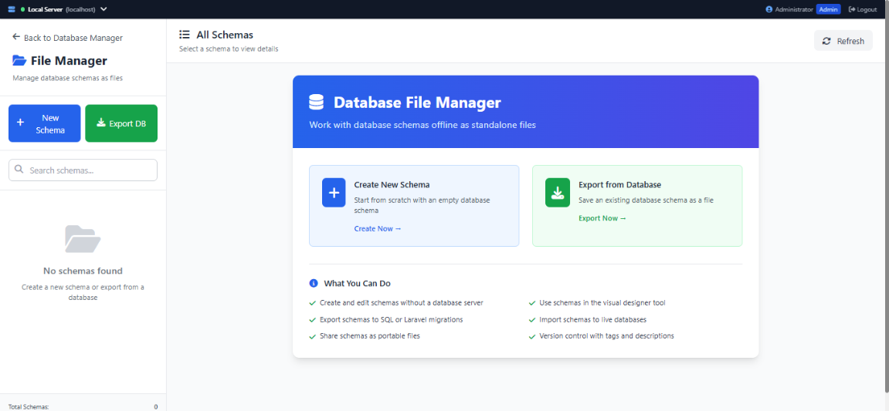
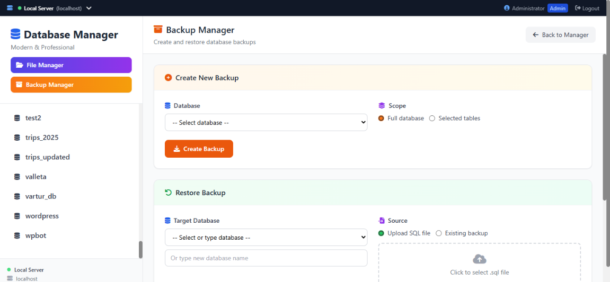

<p align="center">
  
</p>

<h1 align="center">Database Servers Manager</h1>

<p align="center">
  <strong>A modern, self-hosted MySQL database management tool.</strong><br>
  Browse tables, design schemas visually, export to 10+ formats, backup & restore — all from a beautiful web UI.
</p>

<p align="center">
  <a href="#-quick-start"></a>&nbsp;
  
  
  
  
</p>

---

## ✨ Why This Tool?

| Pain Point | Solution |
|---|---|
| phpMyAdmin feels outdated | Modern, responsive UI with Tailwind CSS |
| Managing multiple servers is tedious | One-click server switching from any page |
| No visual database design | Built-in ERD designer with drag & drop |
| Exporting schemas is manual work | One-click export to SQL, Prisma, Laravel, TypeScript, Django, and more |
| Backup tools require CLI | Visual backup & restore with file management |

---

## 🚀 Quick Start

**Prerequisites:** PHP 8.0+ · MySQL 5.7+ · Apache/Nginx (or any PHP-capable server)

### 1. Clone & Go

```bash
git clone https://github.com/mediansai/database-servers-manager.git
cd database-servers-manager
```

### 2. Configure Your Server

Open `config.php` and update the `local` server entry:

```php
$GLOBALS['DB_SERVERS'] = [
    'local' => [
        'label'    => 'Local Server',
        'host'     => 'localhost',     // ← your MySQL host
        'user'     => 'root',         // ← your MySQL user
        'password' => '',             // ← your MySQL password
        'charset'  => 'utf8mb4',
    ],
    'production' => [
        'label'    => 'Production',
        'host'     => 'db.example.com',
        'user'     => 'app_user',
        'password' => 'secure_password',
        'charset'  => 'utf8mb4',
    ],
    // Add as many servers as you need...
];
```

### 3. Open in Browser

Point your browser to wherever you placed the files:

```
http://localhost/database-servers-manager/
```

### 4. Login

| Username | Password | Role |
|---|---|---|
| `admin` | `admin123` | Full access (create, edit, delete, backup) |
| `viewer` | `manager` | Read-only access |

> [!TIP]
> Change default passwords immediately! Generate a new hash:
> ```bash
> php -r "echo password_hash('YourNewPassword', PASSWORD_BCRYPT);"
> ```
> Then replace the hash in `config.php` under `$GLOBALS['APP_USERS']`.

**That's it.** No Composer. No `npm install`. No database migrations. Just PHP + MySQL.

---

## 📸 Screenshots

<table>
  <tr>
    <td align="center"><strong>🔐 File & Schema Manager</strong><br><em>Manage database as schemas</em></td>
    <td align="center"><strong>📊 Export</strong><br><em>Schema & data export</em></td>
  </tr>
  <tr>
    <td align="center"><strong>🎨 Visual Designer</strong><br><em>Drag & drop ERD canvas</em></td>
    <td align="center"><strong>💾 Backups</strong><br><em>Create, restore, download</em></td>
  </tr>
</table>

 
 
 
 

---

## 🎯 Features

### 🗄️ Multi-Server Management
- Configure unlimited MySQL servers in `config.php`
- Switch between servers instantly from the top bar
- Connection status indicators with graceful error handling

### 📋 Table Browser
- Browse all databases and tables in a sidebar
- Paginated data view with configurable rows per page
- **Inline editing** — click a cell to edit, save with Enter
- Insert, duplicate, and delete rows
- Column sorting and search/filter
- Full table structure view (columns, types, keys, indexes)

### 🎨 Visual Database Designer
- Interactive ERD (Entity-Relationship Diagram) canvas
- Drag-and-drop table positioning
- Create tables and columns visually
- Draw foreign key relationships between tables
- Auto-layout algorithm for clean arrangements
- Minimap navigation and zoom controls
- Export diagram as PNG image
- **File mode** — design schemas offline without a database connection

### 📤 Schema Export (10+ Formats)

| Format | Output | Use Case |
|---|---|---|
| **MySQL SQL** | `.sql` dump | Database migration, backup |
| **SQLite** | SQLite schema | Lightweight/embedded apps |
| **Prisma** | `.prisma` schema | Node.js / Next.js projects |
| **Laravel** | Migration files | PHP Laravel framework |
| **TypeScript** | `.ts` interfaces | Frontend type safety |
| **Zod** | Validation schemas | Runtime validation |
| **JSON Schema** | Draft-07 | API documentation |
| **Django** | `models.py` | Python Django projects |
| **Sequelize** | Node.js ORM models | Express / Node.js apps |
| **Mongoose** | MongoDB schemas | MongoDB / MERN stack |

### 💾 Backup & Restore
- Create full or partial (selected tables) backups
- Download backup files as `.sql`
- Restore from uploaded `.sql` files or saved backups
- Backup file management with size and date tracking
- Admin-only access control

### 📁 File Manager
- Create and manage database schemas as standalone `.dbschema` files
- Work with schemas completely offline — no database connection needed
- Export a live database to a file, or import a file to a live database
- Tag, describe, and version your schemas
- Open files directly in the visual designer

### 🔐 Authentication & Security
- Session-based auth — no external database needed for users
- Role-based access control (admin / viewer)
- Session timeout with auto-logout
- Session fixation protection via `session_regenerate_id()`
- bcrypt password hashing
- XSS protection with `htmlspecialchars()` throughout
- SQL injection protection via PDO prepared statements

---

## ⚙️ Configuration Reference

All configuration lives in a single file: **`config.php`**

### Database Servers

```php
$GLOBALS['DB_SERVERS'] = [
    'local' => [
        'label'    => 'Local Server',      // Display name in UI
        'host'     => 'localhost',          // MySQL host
        'user'     => 'root',              // MySQL username
        'password' => '',                  // MySQL password
        'charset'  => 'utf8mb4',           // Connection charset
    ],
    'production' => [
        'label'    => 'Production',
        'host'     => 'db.example.com',
        'user'     => 'app_user',
        'password' => 'secure_password',
        'charset'  => 'utf8mb4',
    ],
    // Add as many servers as you need...
];
```

### Users

```php
$GLOBALS['APP_USERS'] = [
    'admin' => [
        'password' => '$2y$10$....',       // bcrypt hash
        'name'     => 'Administrator',     // Display name
        'role'     => 'admin',             // 'admin' or 'viewer'
    ],
];
```

### Application Settings

| Constant | Default | Description |
|---|---|---|
| `ROWS_PER_PAGE` | `50` | Number of rows displayed per page |
| `MAX_QUERY_LENGTH` | `10000` | Maximum characters in SQL queries |
| `SESSION_TIMEOUT` | `3600` | Session timeout in seconds (1 hour) |
| `BACKUP_DIR` | `./storage/backups` | Where backup files are stored |

### Feature Flags

| Constant | Default | Description |
|---|---|---|
| `ALLOW_DELETE` | `true` | Allow row deletion |
| `ALLOW_INLINE_EDIT` | `true` | Allow inline cell editing |
| `ALLOW_SQL_QUERIES` | `true` | Allow running raw SQL queries |

---

## 🌐 Remote MySQL Server Configuration

If your MySQL database server is hosted on a remote server (VPS, Cloud server, Docker container, or another machine on your local network), follow these steps to allow remote connections:

### 1. Enable MySQL Remote Connections (`bind-address`)

Edit your MySQL configuration file:
- **Linux (Ubuntu/Debian):** `/etc/mysql/mysql.conf.d/mysqld.cnf` or `/etc/mysql/my.cnf`
- **Linux (CentOS/RHEL):** `/etc/my.cnf`
- **Windows (XAMPP):** `C:\xampp\mysql\bin\my.ini`

Find the `bind-address` line and set it to `0.0.0.0` (to listen on all network interfaces) or your PHP server's specific IP:

```ini
[mysqld]
bind-address = 0.0.0.0
```

### 2. Grant User Privileges for Remote Access

Connect to MySQL on the target server and run the following SQL commands to grant permission for a user connecting from any IP (`%`) or from your specific web server IP:

```sql
-- Allow access from any IP address ('%'):
CREATE USER 'remote_user'@'%' IDENTIFIED BY 'YourSecurePassword';
GRANT ALL PRIVILEGES ON *.* TO 'remote_user'@'%' WITH GRANT OPTION;
FLUSH PRIVILEGES;

-- OR restrict access strictly to your Web Manager server's IP address:
CREATE USER 'remote_user'@'192.168.1.50' IDENTIFIED BY 'YourSecurePassword';
GRANT ALL PRIVILEGES ON *.* TO 'remote_user'@'192.168.1.50' WITH GRANT OPTION;
FLUSH PRIVILEGES;
```

### 3. Open Firewall Port 3306

Ensure port **3306** (default MySQL port) is open on your remote server:

- **Ubuntu (UFW):**
  ```bash
  sudo ufw allow 3306/tcp
  ```
- **CentOS / RHEL (Firewalld):**
  ```bash
  sudo firewall-cmd --zone=public --add-port=3306/tcp --permanent
  sudo firewall-cmd --reload
  ```
- **Cloud Security Groups (AWS EC2 / DigitalOcean / GCP):**
  Add an Inbound Security Rule allowing TCP port **3306** from your PHP application server's IP.

### 4. Restart MySQL Service

Restart MySQL to apply the new configuration:
```bash
# Linux
sudo systemctl restart mysql   # or mariadb

# Windows
net stop MySQL && net start MySQL
```

---

## 🏗️ Project Architecture

```
database-servers-manager/
│
├── config.php              # All configuration (servers, users, settings)
├── index.php               # Main entry — table browser
├── login.php               # Authentication page
├── landing.php             # Public landing/showcase page
├── designer.php            # Visual ERD designer
├── backup.php              # Backup & restore manager
├── file_manager.php        # Offline schema file manager
│
├── includes/               # PHP classes (business logic)
│   ├── Auth.php            # Session-based authentication
│   ├── Database.php        # PDO connection singleton
│   ├── ServerManager.php   # Multi-server switching
│   ├── DatabaseOperations.php  # CRUD, table metadata
│   ├── DatabaseBackup.php  # Backup creation & restore
│   ├── DatabaseDesigner.php    # ERD schema fetching
│   ├── DatabaseFileManager.php # .dbschema file I/O
│   ├── SchemaExporter.php  # 10-format export engine
│   ├── DatabaseExportImport.php # SQL export/import
│   ├── ColumnTypeHelper.php    # Column type utilities
│   └── LaravelMigrationGenerator.php # Laravel migrations
│
├── handlers/               # AJAX endpoints
│   ├── auth_handler.php    # Login, logout, server switch
│   ├── ajax_handler.php    # Table CRUD operations
│   ├── backup_handler.php  # Backup API
│   ├── designer_handler.php # Designer API
│   ├── export_handler.php  # Schema export API
│   └── file_handler.php    # File manager API
│
├── views/                  # PHP templates
│   ├── header.php          # HTML head + top navigation bar
│   ├── footer.php          # Closing tags + scripts
│   ├── sidebar.php         # Database/table sidebar
│   ├── table_view.php      # Data grid component
│   ├── database_overview.php # Database summary cards
│   └── modals.php          # All modal dialogs
│
├── assets/
│   ├── css/styles.css      # Custom styles
│   └── js/
│       ├── main.js         # Core utilities & AJAX
│       ├── designer.js     # ERD canvas engine
│       ├── editor.js       # Inline cell editor
│       ├── file_manager.js # File manager logic
│       └── modals.js       # Modal management
│
├── storage/
│   ├── backups/            # Generated .sql backup files
│   └── schemas/            # .dbschema files
│
├── LICENSE                 # MIT License
└── README.md               # ← You are here
```

---

## 🔒 Roles & Permissions

| Action | Admin | Viewer |
|---|---|---|
| Browse databases & tables | ✅ | ✅ |
| View table data | ✅ | ✅ |
| Run SQL queries | ✅ | ✅ |
| Insert / Edit / Delete rows | ✅ | ❌ |
| Create / Drop tables | ✅ | ❌ |
| Create backups | ✅ | ❌ |
| Restore backups | ✅ | ❌ |
| Delete backup files | ✅ | ❌ |
| Download backups | ✅ | ✅ |
| Use visual designer | ✅ | ✅ |
| Export schemas | ✅ | ✅ |

---

## 🛠️ Deployment Tips

### Apache (with XAMPP, WAMP, LAMP, etc.)

Just drop the folder in your web root — it works out of the box. No `.htaccess` rules required.

### Nginx

```nginx
server {
    listen 80;
    server_name dbmanager.local;
    root /var/www/database-servers-manager;
    index index.php;

    location / {
        try_files $uri $uri/ =404;
    }

    location ~ \.php$ {
        include fastcgi_params;
        fastcgi_pass unix:/run/php/php8.1-fpm.sock;
        fastcgi_param SCRIPT_FILENAME $document_root$fastcgi_script_name;
    }

    # Protect storage directory
    location /storage/ {
        deny all;
    }
}
```

### Docker (Quick)

```dockerfile
FROM php:8.2-apache
RUN docker-php-ext-install pdo pdo_mysql
COPY . /var/www/html/
RUN chown -R www-data:www-data /var/www/html/storage
```

```bash
docker build -t dbmanager .
docker run -p 8080:80 dbmanager
```

---

## 🤝 Contributing

Contributions are welcome! Here's how:

1. **Fork** the repository
2. **Create** a feature branch: `git checkout -b feature/my-feature`
3. **Commit** your changes: `git commit -m "Add my feature"`
4. **Push** to the branch: `git push origin feature/my-feature`
5. **Open** a Pull Request

### Development Setup

```bash
# Clone your fork
git clone https://github.com/mediansai/database-servers-manager.git

# Start a local PHP server (if not using Apache/Nginx)
cd database-servers-manager
php -S localhost:8000
```

### Code Style
- PHP: PSR-12 compatible
- JavaScript: ES6+ with async/await
- CSS: Tailwind utility classes via CDN

---

## 📝 License

This project is licensed under the **MIT License** — see the [LICENSE](LICENSE) file for details.

---

<p align="center">
  <sub>Built with ❤️ for developers who need a modern database management tool.</sub><br>
  <sub>⭐ Star this repo if you find it useful!</sub>
</p>
